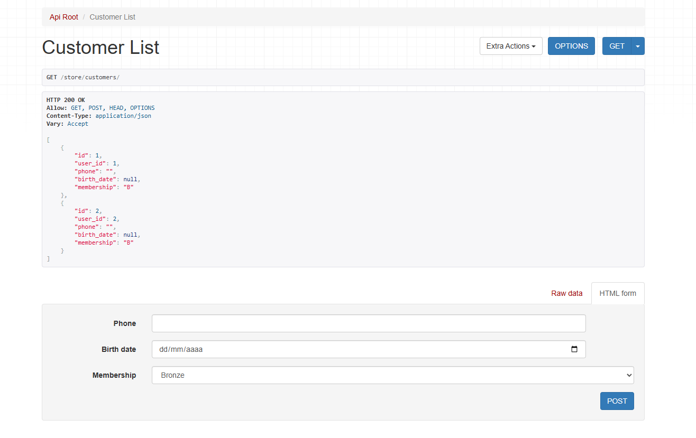
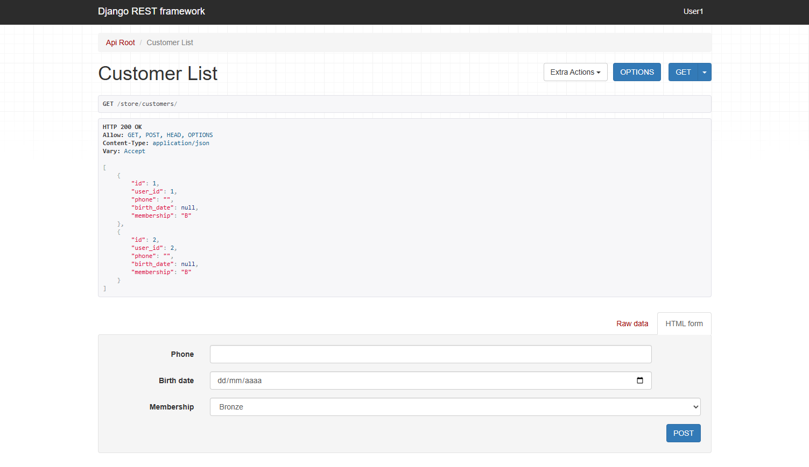
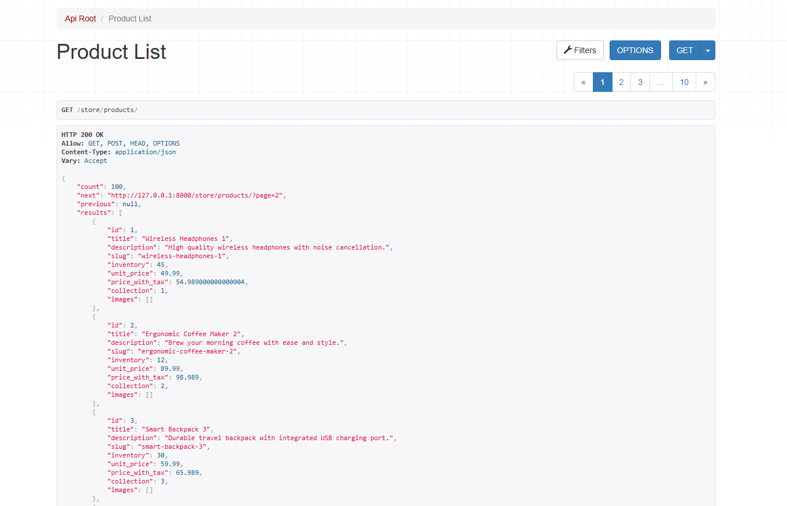
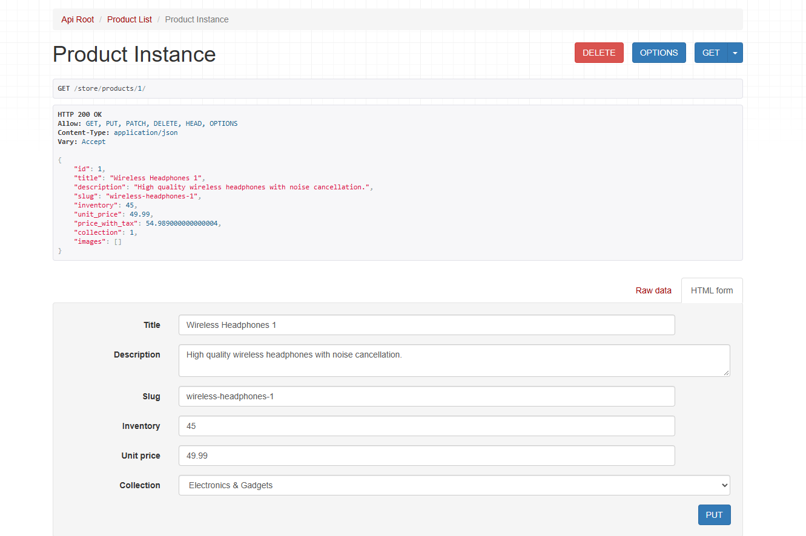
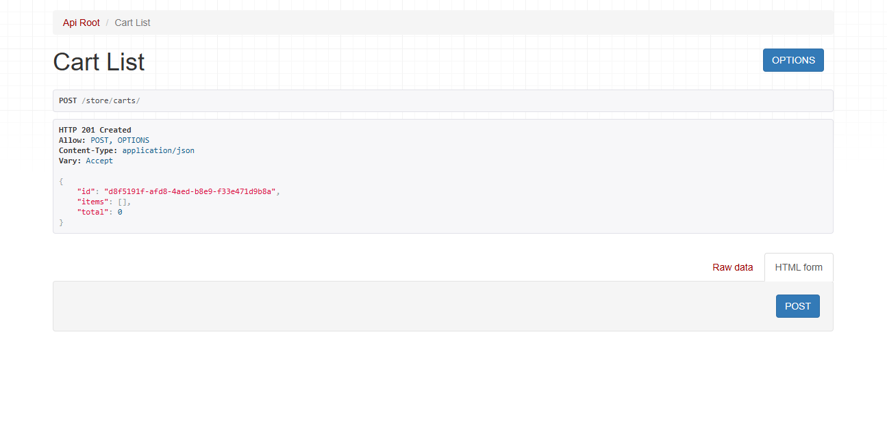
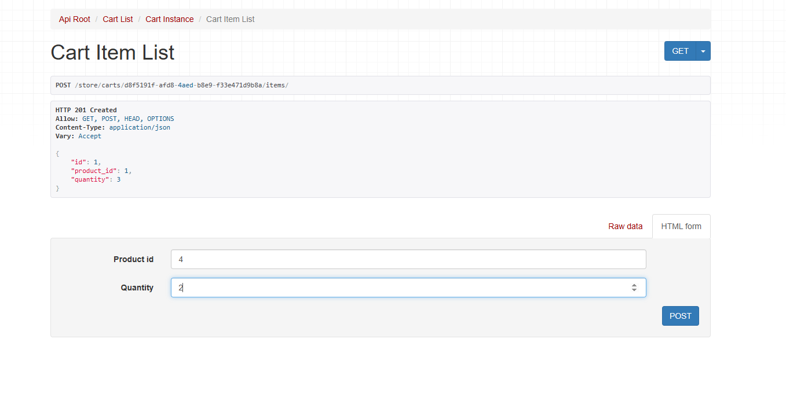
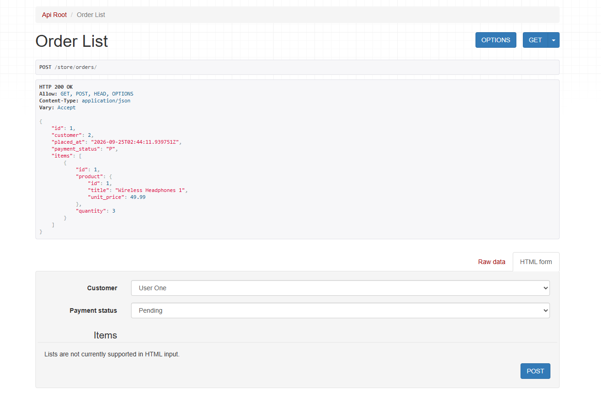
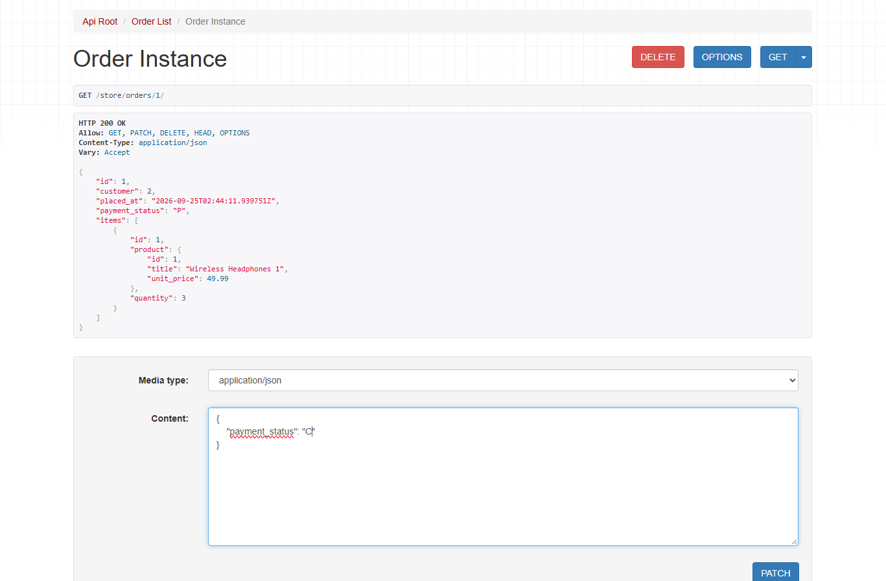

<h1 align="center"> StoreFront e-commerce project </h1>

  <a href="#-technologies">Technologies</a>&nbsp;&nbsp;&nbsp;|&nbsp;&nbsp;&nbsp;
  <a href="#-project">Project</a>&nbsp;&nbsp;&nbsp;|&nbsp;&nbsp;&nbsp;
  <a href="#memo-license">License</a>

  

 

  

  

  

  

  

  

  

  

## 🚀 Technologies

This project was developed using the following core technologies:

- Python
- Django
- Django REST framework
- Djoser
- MySQL
- Git

For a complete list of all dependencies and packages used (including testing and production tools), check the Pipfile.

## 💻 Project

Storefront is a Django-based e-commerce backend project designed to handle robust data models, RESTful APIs, and background processing. The project was made to explore advanced backend workflows, database management, and automated testing as a programmer.

## :memo: License

This project is licensed under the MIT License